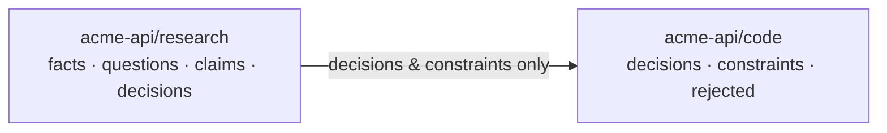
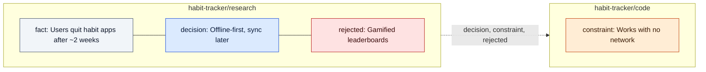

# ContextOS

**One shared memory for every AI tool you use.**

You make a decision in Claude Code. Next week, ChatGPT suggests the approach you already rejected. Your teammate's Cursor has never heard of either. You paste a stale `context.md` around by hand.

ContextOS fixes that. You save what matters once: decisions, constraints, dead ends, open questions. Every tool gets a compiled, token-budgeted briefing from it: Claude Code, Codex, Cursor, Gemini CLI, claude.ai, ChatGPT, a local Ollama model, or a human teammate.

```
$ ctx save "Use SQLite for the index, not Postgres" -k decision -w "no server to install"
saved [c:a505] decision -> acme-api/code

$ ctx save "GraphQL gateway" -k rejected -w "schema churn cost more than it saved"
saved [c:5270] rejected -> acme-api/code
```

…and every agent in the repo now starts its session knowing this:

```markdown
### Decisions
- Use SQLite for the index, not Postgres [c:a505]
  - why: no server to install

### Rejected: do not propose these again
- GraphQL gateway [c:5270]
  - why: schema churn cost more than it saved
```

- **Local-first.** A single binary with SQLite built in. No Docker, no Postgres, no account, no cloud required.
- **Git-synced.** Your memory is a private git repo you own. Syncs across your machines with zero merge conflicts, by design.
- **No AI in the loop.** Saving and compiling never call a model. Nothing is summarised away, and nothing leaves your machine unless you push it.
- **Budgeted.** Agents get the *most useful* ~700 tokens, not a 20-page dump. Chat surfaces get more. Humans get everything.

---

## Contents

- [Install](#install)
- [5-minute quickstart](#5-minute-quickstart)
- [The ideas, in one page](#the-ideas-in-one-page)
- [Using it every day](#using-it-every-day)
- [From idea to code](#from-idea-to-code)
- [Every surface, one memory](#every-surface-one-memory)
- [Sync across machines](#sync-across-machines)
- [Command reference](#command-reference)
- [How it works](#how-it-works)
- [FAQ](#faq)
- [Status and roadmap](#status-and-roadmap)

---

## Install

**macOS / Linux**

```sh
curl -fsSL https://raw.githubusercontent.com/Percobain/ContextOS/main/install.sh | sh
```

**Windows** (PowerShell)

```powershell
irm https://raw.githubusercontent.com/Percobain/ContextOS/main/install.ps1 | iex
```

**From source** (any platform with [Rust](https://rustup.rs)):

```sh
cargo install --git https://github.com/Percobain/ContextOS ctx-cli
```

Check it worked: `ctx --version`. That's the whole install: one binary called `ctx`.

---

## 5-minute quickstart

### 1. Wire up a project

```sh
cd ~/code/acme-api
ctx init
```

```
ContextOS: acme-api/code
  ✓ .ctx.yaml   binds this repo to acme-api/code (commit it)
  ✓ AGENTS.md   ContextOS section added; your own content is kept (commit it)
  claude-code:
    ✓ wrote    CLAUDE.md imports AGENTS.md
    ✓ wrote    Claude Code MCP server (.mcp.json)
    ✓ wrote    Claude Code SessionStart hook (.claude/settings.local.json)
```

`ctx init` detects which agents you have installed (Claude Code, Codex, Cursor, Gemini CLI) and wires each one in. It is safe to run twice. It only adds its own entries, never touches your other config, and refuses to merge into an existing hooks file.

### 2. Save what you know

```sh
ctx save "Never call the payments API synchronously from a request handler" \
    -k constraint -w "p99 latency budget is 200ms" -r src/payments.rs

ctx save "Use SQLite for the index, not Postgres" -k decision -w "no server to install"

ctx save "GraphQL gateway" -k rejected -w "schema churn cost more than it saved"
```

`-k` is the kind, `-w` is *why*, `-r` points at files, docs or URLs. Saving is instant and offline.

### 3. See what your agents see

```sh
ctx pack
```

```markdown
## Project context: acme-api/code

Compiled by ContextOS. These are settled; build on them.

### Constraints

- Never call the payments API synchronously from a request handler (`src/payments.rs`) [c:cece]
  - why: p99 latency budget is 200ms

### Decisions

- Use SQLite for the index, not Postgres [c:a505]
  - why: no server to install

### Rejected: do not propose these again

- GraphQL gateway [c:5270]
  - why: schema churn cost more than it saved

### Working with ctx
Active branch: acme-api/code. The context above is compiled; don't re-derive it.
Save only when I explicitly say so, plus one batched call at session end.
Use ctx_append(kind, text, why, refs). Don't log progress or summaries.
Cross-branch material: ctx_propose(target_branch, ...).
<!-- ctx/1 b=acme-api/code n=3 t=219/700 root=b3:470c56f5 gen=01M2SRHF v=0.1.0 -->
```

This same section now lives in your repo's `AGENTS.md`, which Claude Code, Codex, Cursor, Gemini CLI and 30+ other tools read automatically. It refreshes every time you `ctx save`.

### 4. Open your agent and work

Start Claude Code (or Codex, or Cursor) in the repo. It already knows the constraints, the decisions, and what not to suggest again. When something worth keeping comes up, tell it:

> "Save that as a decision: we retry webhooks with exponential backoff, because Stripe retries for 3 days anyway."

It calls `ctx_append`, and the claim is in the shared memory for every other tool.

**That's it.** The rest of this README covers doing more with it.

---

## The ideas, in one page

### Claims: six kinds, and that's all

Everything in ContextOS is a **claim**: a short statement plus an optional *why*.

| Kind | Use it for | Example |
|---|---|---|
| `decision` | Something you chose | "Use SQLite for the index" |
| `constraint` | A hard limit that must hold | "p99 must stay under 200ms" |
| `rejected` | An approach you ruled out, and why | "GraphQL gateway: schema churn" |
| `fact` | Something true about the world | "Stripe retries webhooks for 3 days" |
| `question` | Something still open | "Do we need a Python SDK?" |
| `claim` | A belief or bet, not yet proven | "Webhooks beat polling for our users" |

**`rejected` and `constraint` are the most valuable kinds.** They hold the knowledge nobody writes down, the kind that makes a model (or a new teammate) suggest the thing you already tried.

**Nothing is ever deleted.** Changing your mind means saving a new claim that *supersedes* the old one. The history stays, and handoffs show it ("Previously: use Postgres").

### Branches: separate contexts that share conclusions

A project has **branches**, like `research` and `code`. They are not git branches: you work in all of them at once.



- `research` is where you think: facts, open questions, bets.
- `code` is what your coding agents see. It **inherits only the conclusions** from research (decisions and constraints), not forty open questions. That keeps agent context small and sharp.
- Each branch only accepts certain kinds. `ctx save "..." -k claim` inside a code repo is refused with a hint: `try --to acme-api/research`.

`ctx init` creates `research` and `code` for you. Add more with templates: `ctx branch new gtm --parent research --template gtm` (templates: `research`, `code`, `gtm`, `writing`).

### Packs: compiled, budgeted, deterministic

A **pack** is a branch compiled for one reader, under a token budget:

| Shape | For | Default budget |
|---|---|---|
| `agents-md` | coding agents (`AGENTS.md`) | 700 tokens |
| `dossier` | claude.ai / ChatGPT / any chat | 4,000 tokens |
| `handoff` | a human teammate | unlimited |
| `markdown` | piping into anything (`ctx pack \| ollama run qwen3`) | 1,500 tokens |

The compiler picks the most useful claims for the budget. It favours constraints and decisions, recent and highly rated claims, and coverage across topics, and it skips near-duplicates. It drops the *why* before it drops a claim. The same inputs always produce byte-identical output, and the footer (`root=b3:…`) identifies exactly which claims went in.

---

## Using it every day

| I want to… | Run |
|---|---|
| Record a decision | `ctx save "..." -k decision -w "why"` |
| Record something for research while in a code repo | `ctx save "..." -k fact --to research` |
| Change my mind about a decision | `ctx save "new decision" -k decision --supersedes c:a505` |
| Delete a claim, or a whole idea | `ctx delete c:a505` / `ctx delete notes-app` |
| Find something | `ctx search webhooks retry` |
| See the full context for a task | `ctx pack --task "add refund endpoint"` |
| Write a handoff doc | `ctx pack --for handoff > HANDOFF.md` |
| See everything recorded | `ctx log -v` |
| Review what agents proposed for other branches | `ctx review` → `ctx review accept c:866c` |
| Mark a claim as useful (or misleading) | `ctx rate c:a505 up` / `down` |
| Find near-duplicates to clean up | `ctx refine` |
| Check that everything is wired correctly | `ctx doctor` |

Anything that takes an id accepts the short `c:xxxx` tag shown in packs and logs.

**What should I save?** Save what would be expensive to rediscover: why you chose X over Y, what you tried that failed, limits you must respect, and questions that are still open. **Don't** save progress notes ("implemented the handler") or summaries. That's what git history is for. The agent operating rules say the same, so agents only save when you ask.

---

## From idea to code

The flow ContextOS is built around: you have an idea in ChatGPT or claude.ai, research it there, end with a spec, and hand it to a coding agent, without ever copying context between tools.

```sh
ctx new habit-tracker
```

That creates the project and points your chat tools at its research branch. Now research in claude.ai or ChatGPT (with the [connector](worker/README.md), the [extension](extension/README.md), or the clipboard). Say **"save that"** whenever something is worth keeping. When the research is done, say **"ctx spec"**, and the chat writes the full spec and saves it to the project.

```sh
ctx build habit-tracker
cd habit-tracker && claude
```

`ctx build` pulls the latest research, creates the repo, and writes `SPEC.md` (the spec), `AGENTS.md` (the decisions, constraints and rejected ideas from research) and your agent's configuration. Tell the agent "Build this from SPEC.md". If you later refine the spec in the chat, the next session updates `SPEC.md` and tells the agent to re-read it (it never overwrites your own edits).

See the whole project at a glance with `ctx map > MAP.md`, a "metro map" where each branch is a line and each claim a station, coloured by kind. It renders directly on GitHub:



---

## Every surface, one memory

### Coding agents (Claude Code, Codex, Cursor, Gemini CLI)

`ctx init` gives each agent:

1. **`AGENTS.md`**: the compiled pack on disk. It works with no install at all, so a teammate who has never heard of ContextOS still gets it, and it keeps working even if a hook breaks.
2. **An MCP server** (`ctx mcp`) with exactly five tools: `ctx_index`, `ctx_pack`, `ctx_search`, `ctx_append`, `ctx_propose`. Five small schemas keep the per-turn context tax low.
3. **A SessionStart hook** (Claude Code): pulls the latest claims and refreshes `AGENTS.md` when a session starts. It never injects on every prompt, because that would break prompt caching.

### claude.ai and ChatGPT: the Cloudflare Worker (no extension needed)

A small, stateless MCP server that you deploy once to your own Cloudflare account (free tier). You add it as a **custom connector**, and claude.ai and ChatGPT get the same five tools, reading and writing your private memory repo. Research you do on claude.ai at 11pm shows up in your laptop's next session.

→ Setup guide: [`worker/README.md`](worker/README.md) (about 10 minutes).

### Any chat, no setup: the clipboard

```sh
ctx pack research --clip        # copy a dossier, paste it into any chat
```

Every dossier ends with an instruction to the model. When you say **"ctx save"**, it replies with a fenced `ctx-claims` block. Copy that reply, then:

```sh
ctx save --paste --to research  # reads the block from your clipboard
```

This works with any chat UI: Gemini, Perplexity, DeepSeek, a local web UI.

### Browser extension (optional convenience)

A Chrome extension that inserts context into the chat box (**Alt+Shift+C**) and adds a **Save to ctx** button under `ctx-claims` blocks. It talks to `ctx daemon`, a local API on `127.0.0.1:7777` that is loopback-only and token-protected.

→ Setup: [`extension/README.md`](extension/README.md).

### Local models and scripts

```sh
ctx pack | ollama run qwen3
ctx pack --for markdown --task "design the refund flow" > context.md
```

### Humans

```sh
ctx pack --for handoff > HANDOFF.md
```

This gives a teammate where things stand and why, what was tried and rejected, the constraints to respect, open questions, what changed along the way, and which files to read first.

---

## Sync across machines

Your memory lives in `~/ctx` (`%USERPROFILE%\ctx` on Windows) and is a git repo. To sync it, point it at a **private** repo:

```sh
git -C ~/ctx remote add origin git@github.com:you/ctx-store.git
ctx sync
```

After that:
- `ctx sync` commits, pulls and pushes. It also refreshes the compiled packs the Worker serves.
- Claude Code sessions pull at startup (via the hook), and the MCP server commits and pushes 30 seconds after an agent saves.
- **Conflicts can't happen.** Each machine writes only to its own file (`log/<machine>/2026-09.jsonl`), so two laptops saving at the same time just touch different files.

With no remote, everything still works locally. Offline is a normal state.

---

## Command reference

| Command | What it does |
|---|---|
| `ctx new <idea>` | Start an idea: creates its research and code branches and points chat tools at research |
| `ctx build <idea>` | Hand an idea to a coding agent: new repo with `SPEC.md`, `AGENTS.md` and agent configs |
| `ctx spec save\|show\|ls` | Save a spec from a file, stdin or `--paste`; print or list documents |
| `ctx map [project]` | Draw the project as a Mermaid metro map (`--out MAP.md`) |
| `ctx init` | Wire the current repo: `.ctx.yaml`, `AGENTS.md`, agent configs. Idempotent. |
| `ctx save "<text>"` | Record a claim. `-k kind`, `-w why`, `-r refs`, `-t tags`, `--to branch`, `--supersedes id`, `--paste` |
| `ctx pack [branch]` | Compile context. `--task`, `--budget`, `--for agents-md\|dossier\|handoff\|markdown`, `--clip`, `--out FILE` |
| `ctx search <query>` | Full-text search (stemmed). `-b branch`, `-k kind`, `-v` |
| `ctx log` | Everything recorded, oldest first. `--since 2026-09-01`, `-k`, `-v` |
| `ctx show <id>` | One claim in full, with its status history |
| `ctx status` | Store, remote, current branch, counts, pending reviews |
| `ctx use <branch>` | Default branch outside a repo (for chat surfaces) |
| `ctx branch new\|ls\|merge\|archive` | Manage branches |
| `ctx review [accept\|reject]` | Handle claims agents proposed for other branches |
| `ctx delete <c:xxxx \| idea \| idea/branch>` | Delete a claim, a branch or a whole idea (alias `ctx remove`). Gone everywhere, kept in history; asks before deleting more than one claim |
| `ctx rate <id> up\|down` | Feedback that affects ranking |
| `ctx refine` | Find near-duplicates worth merging |
| `ctx sync` | Commit, pull, push |
| `ctx verify [root]` | Compare a pack's root with this machine: in-sync / behind / ahead-or-diverged |
| `ctx eval` | Score packs against known Q&A (optionally with a local Ollama model) |
| `ctx doctor` | Diagnose wiring, git, daemon. Each problem comes with its fix. |
| `ctx reindex` | Rebuild the search index from the log (safe any time) |
| `ctx daemon` / `ctx daemon token` | Local API for the browser extension |
| `ctx mcp` | MCP server over stdio (agents launch this) |

`ctx <command> --help` shows every flag.

---

## How it works

```
 log/<machine>/*.jsonl        append-only, one writer per file, synced by git   ← the only source of truth
        │
        ▼
 .cache/ctx.db                SQLite + full-text index; disposable (ctx reindex rebuilds it in ~1s)
        │
        ▼
 branch DAG                   refs/branches.yaml: which claims each branch can see
        │
        ▼
 compiler                     picks the best claims under a token budget (pure, deterministic)
        │
        ▼
 AGENTS.md · MCP · Worker · clipboard · stdout · handoff
```

- **Claims are content-addressed.** Each claim's id (`b3:…`) is the BLAKE3 hash of its normalised content, so the same claim saved twice is stored once, on every OS. The canonical form is specified in [`docs/canonical.md`](docs/canonical.md) and checked against an independent Python implementation in CI.
- **The compiler** treats packing as budgeted submodular maximisation (relevance + topic coverage − redundancy) solved with lazy greedy. It packs claim text first, then spends leftover budget on the *why*. It uses ideas from [ACE](https://arxiv.org/abs/2510.04618) (itemised context with incremental updates, which avoids "context collapse") and [GCC](https://arxiv.org/abs/2508.00031) (versioned, branchable context).
- **Wire formats** (log records, daemon API, `ctx-claims` block, Worker) are specified in [`docs/protocol.md`](docs/protocol.md).

Rules the codebase never breaks: the log is the only truth, claims are immutable, one writer per file, no model call when saving or merging, branch routing is declared (never guessed by a model), no base64 in anything a model reads, nothing is deleted, and nothing depends on hooks firing.

---

## FAQ

**Does my data leave my machine?**
No, unless you push `~/ctx` to a remote you choose, or deploy the Worker to your own Cloudflare account. There's no ContextOS service and no telemetry.

**Does it use an LLM to summarise my chats?**
No. Nothing is scraped or auto-extracted. You decide what's worth keeping, and saving never calls a model. That's deliberate: auto-extracted "memories" turn into noise fast.

**What does it cost in tokens?**
For a coding agent: about 700 tokens of context once per session (cached by the provider), plus about 300 tokens of tool schemas per turn.

**Why not a vector database?**
At a few thousand curated claims, SQLite full-text search with stemming is fast and good enough. It also keeps the install to a single binary.

**Do I need Docker / Node / Python?**
No. `ctx` is one binary. Node is only needed if you deploy the optional Cloudflare Worker.

**What if I delete `.cache/`?**
Nothing is lost. It's a cache; the next command rebuilds it from the log.

**My repo already has an `AGENTS.md` / `CLAUDE.md` / MCP config.**
ContextOS only manages the section between its `<!-- ctx:begin -->` / `<!-- ctx:end -->` markers, adds one import line to `CLAUDE.md`, and adds its own `ctx` entry to MCP configs. Your content is kept.

**Can my team share one memory?**
Yes. Share the `~/ctx` git repo. Each person's machine writes its own file, so there are still no conflicts. Teammates without ContextOS still get the committed `AGENTS.md`.

---

## Status and roadmap

ContextOS is new (v0.1). Everything above is implemented and covered by tests; CI runs the full suite on Windows, macOS and Linux.

Known limitations:
- Compiling a pack over **10,000 claims** takes ~17ms (target: 15ms). Typical packs, which are narrowed to a task, take under 1ms.
- The browser extension targets Chrome and has not been through extensive real-world UI testing.
- Search is keyword-based. Semantic (embedding) search is planned, behind an opt-in flag.
- Packer weights are initial guesses. `ctx eval` exists to tune them against real projects, and feedback is very welcome.

## Contributing

```sh
cargo test --workspace          # Rust: ~90 tests, incl. golden hashes and packer properties
cd worker && npm ci && npm test # Cloudflare Worker
```

| Path | What |
|---|---|
| `crates/ctx-core` | claim model, canonical form, content addressing, Merkle roots |
| `crates/ctx-store-sqlite` | the SQLite index (the only crate with SQL) |
| `crates/ctx-branch` | branch DAG, inheritance, `.ctx.yaml` |
| `crates/ctx-pack` | the compiler and renderers (pure) |
| `crates/ctx-git` | sharded log, git sync |
| `crates/ctx-app` | operations shared by CLI, MCP and daemon |
| `crates/ctx-mcp`, `ctx-daemon`, `ctx-wire`, `ctx-cli` | the surfaces |
| `worker/`, `extension/` | Cloudflare Worker, Chrome extension |

## License

[Apache-2.0](LICENSE).
